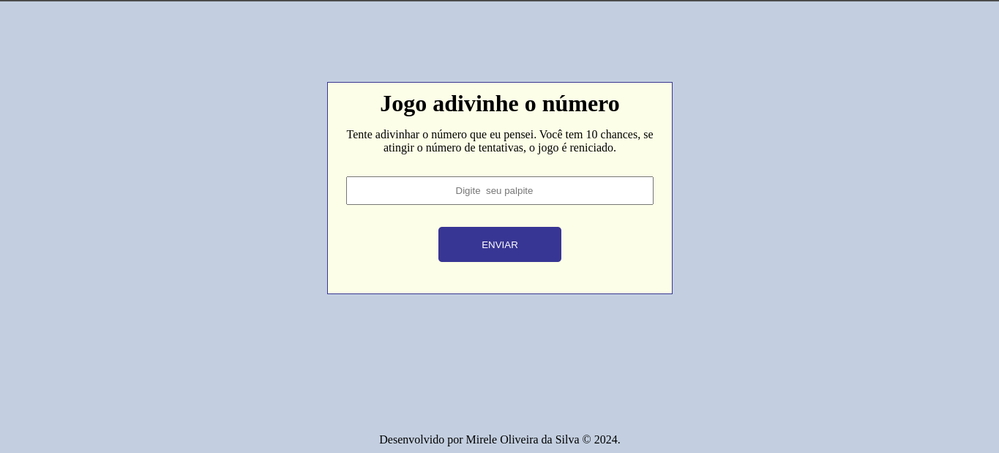
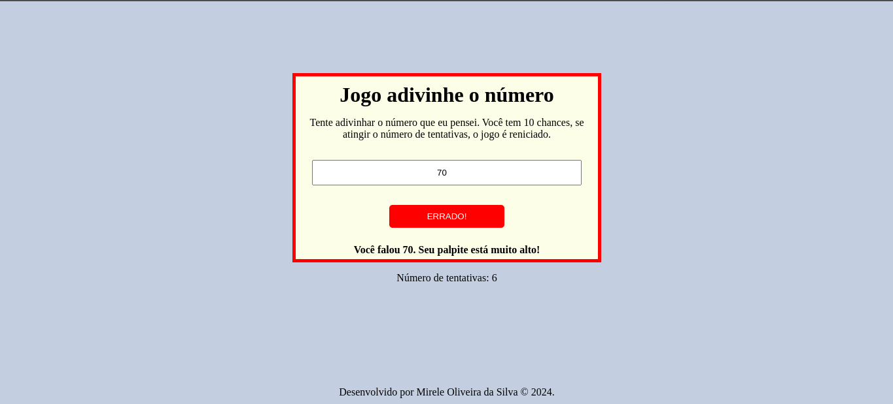
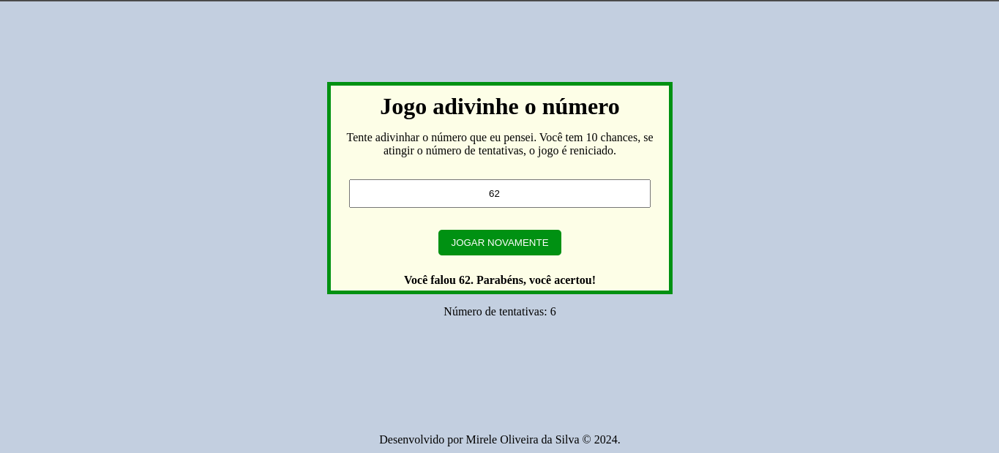

  <h1>
Adivinhe o número
</h1>
  

     
    
    
    
      
 

   
Adivinhe o número é um jogo sobre tentar descobrir o número secreto que o computador escolheu aleatoriamente. O  jogador dar um palpite  e o jogo dá uma dica se o número que o usuário chutou é maior ou menor que o número  sorteado pelo computador. Além disso, o jogo mostra o número de tentativas, fica vermelho se o jogador erra e verde quando  o número está correto.

  
Desenvolvido por <a target="_blank" rel="external" href="https://github.com/MegMinnie/"><strong>Mirele Oliveira da Silva</strong></a>

 

  
  ## Como Acessar a Aplicação

Acesse a aplicação por meio do link: <a href="https://megminnie.github.io/Adivinhe-o-numero/
"_blank">clique aqui</a>

## Screenshots

  

  

   

